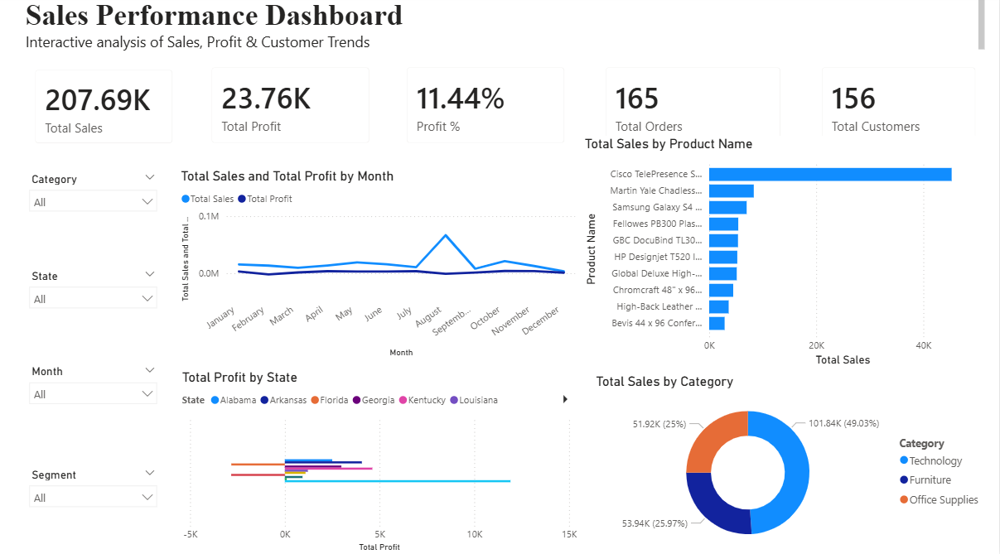

# 📊 Sales Performance Dashboard (Power BI)

This project presents an interactive Sales Performance Dashboard created using Power BI and DAX to analyze business sales data.

## 📸 Dashboard Preview

## 🔹 Key Features
- Total Sales, Profit & Profit %
- Sales vs Profit trend analysis
- Top 10 products by sales
- Region-wise performance
- Category-wise sales distribution
- Interactive slicers & Reset filter button

## 🛠 Tools Used
- Power BI
- DAX
- Data Visualization
- Excel Dataset

## 📁 Files Included
- sales_dashboard.pbix
- order_table (.xlsx)
- Dashboard screenshot

## 🎯 Purpose
This project is part of my learning journey in Data Analytics and Business Intelligence, focusing on building interactive dashboards and deriving business insights from data.

